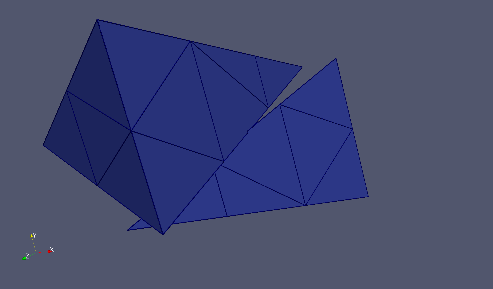
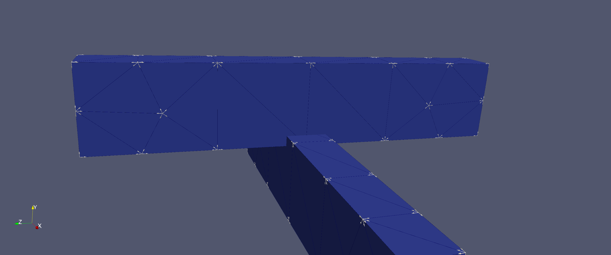

# Manifest

## test_geom.h5m
A simple cube geometry with one volume, six surfaces, and two triangles on each surface.

## no_overlap.h5m
A simple cube and Cylinder geometry with two volumes that do no overlap.

## no_overlap_imp.h5m
The same as no_overlap.h5m but imprinted?

## overlap.h5m
A simple Cube and Sphere geometry with two volumes that do overlap.

## small_overlap.h5m
A simple Cube and Cylinder geometry with two volumes that overlap over a very small region.

## enclosed.h5m
A simple geometry with two concentric Cylinders - one completely enclosed by the larger one.

## brick.exo
A 10 x 10 x 10 brick centered on the origin. No additional sidesets. (tet mesh)

## brick-sidesets.exo
A 10 x 10 x 10 brick centered on the origin. Each surface has a sideset. (tet mesh)

## cyl-brick.exo
A 10 x 10 x 10 brick centered on (0, 0, 10) and a cylinder of radius 5 height 10 centered on the origin w/ rotation axis along Z. (tet mesh)

## overlap-edge.h5m
A simple edge overlap case consisting of two identical pyramids which have a volume overlap along a triangle edge (no overlapping vertices).

  

## beam-overlaps.h5m
A second edge overlap case consisting of two identical beams (cuboids) which have a larger volume overlap (no vertices) along multiple edges.

  

